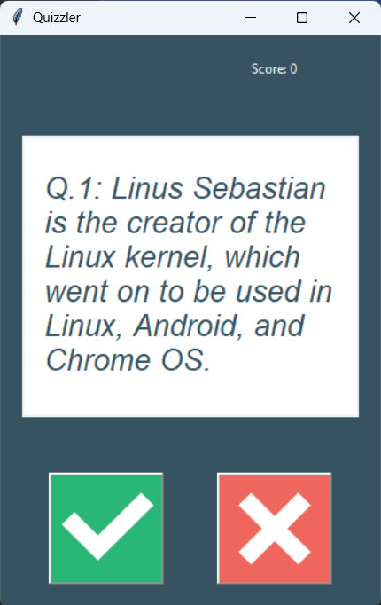

# Quiz Game 🎯

A Python-based quiz application that fetches trivia questions from the [Open Trivia Database](https://opentdb.com/) and presents them in a fun interactive format.  
The project is structured with **OOP principles** and includes a **GUI interface**.

---

## 📂 Project Structure
.
├── data.py              # Contains question_data (list of questions & answers)
├── question_model.py    # Defines the Question class
├── quiz_brain.py        # Handles quiz logic (score, question navigation, answer checking)
├── ui.py                # Builds the QuizInterface (Tkinter GUI)
├── main.py              # Entry point of the project

---

## ▶️ How to Run
1. Clone this repository or copy the files into a folder.
2. Install dependencies (only `requests` is needed for API calls):
   pip install requests
3. Run the program:
   python main.py

---

## 🖼️ Screenshot (Example GUI)

---

## 📜 License
MIT License

Permission is hereby granted, free of charge, to any person obtaining a copy
of this software and associated documentation files (the "Software"), to deal
in the Software without restriction, including without limitation the rights
to use, copy, modify, merge, publish, distribute, sublicense, and/or sell
copies of the Software, and to permit persons to whom the Software is
furnished to do so, subject to the following conditions:

This project is provided "as is", without warranty of any kind.
